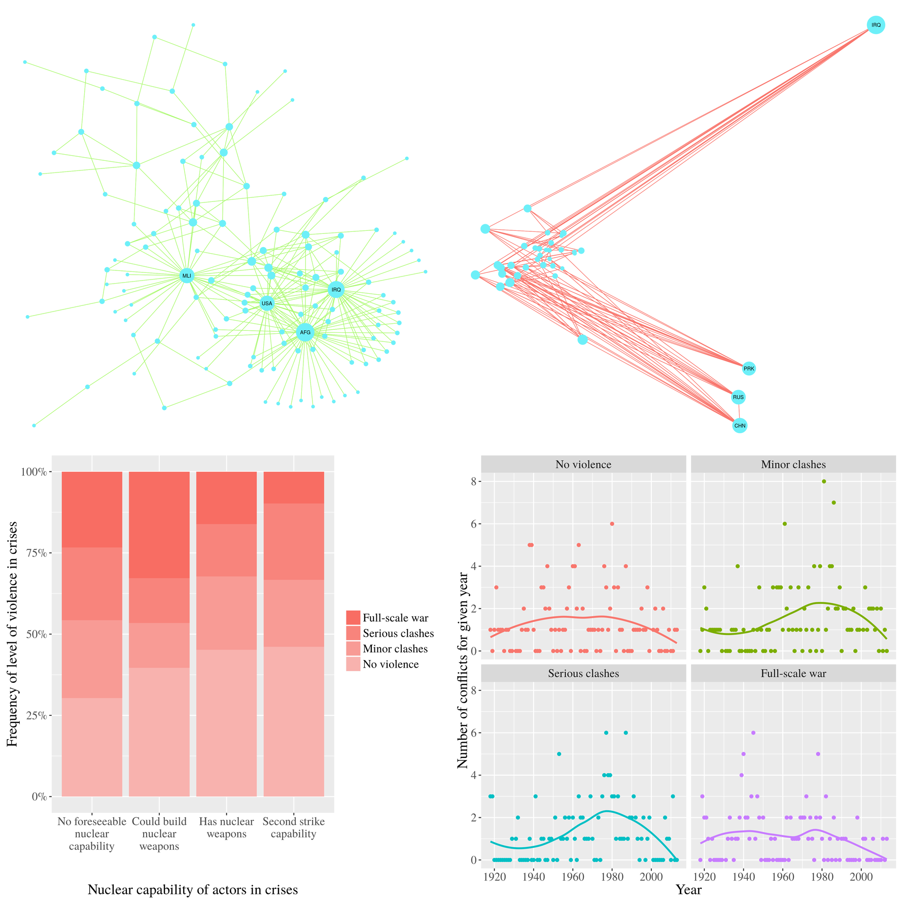

Visualising war, see [the presentation](out/presentation.pdf) for more info.



## Requirements

- texlive
- latexmk
- R
- inkscape

```sh
$ sudo apt-get install texlive-full latexmk r-base inkscape
```

R packages:

- network
- sna
- ggplot2
- GGally
- Hmisc
- scales

```R
$ R --vanilla
install.packages(c("network", "sna", "ggplot2", "GGally", "Hmisc", "scales"))
```

## Building

```sh
$ git clone github.com/mcjohnalds/war-visualised
...
$ make
...
Success! See out/ for output.
$ ls out
nuclear_compared_with_violence.png    # Nuclear/violence bar plot
war_over_time.png                     # War/violence line plot
ally_network.png                      # Ally network plot
enemy_network.png                     # Enemy network plot
presentation.pdf                      # Slideshow
report.pdf                            # Lengthy project report
```

## Troubleshooting

Ensure the following executables are accessible from your $PATH:

- make
- mkdir
- rm
- latexmk
- Rscript
- inkscape
- pdflatex

Check for latex errors in tmp/proposal.log and tmp/report.log.
